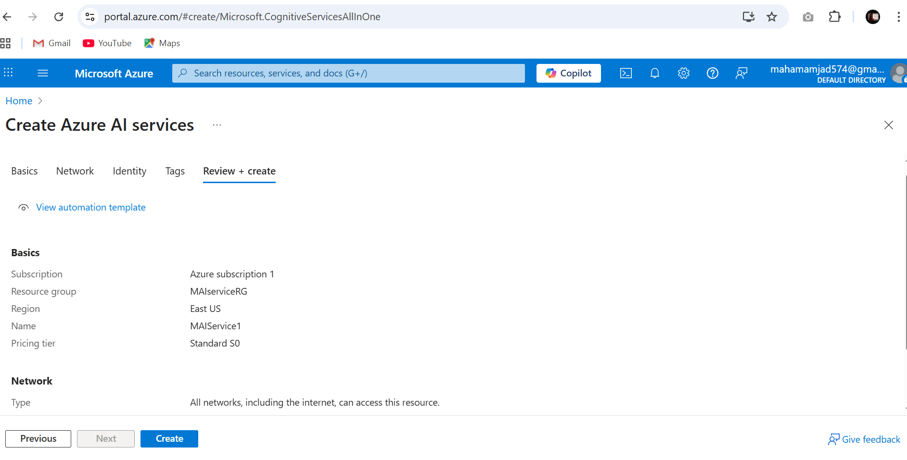
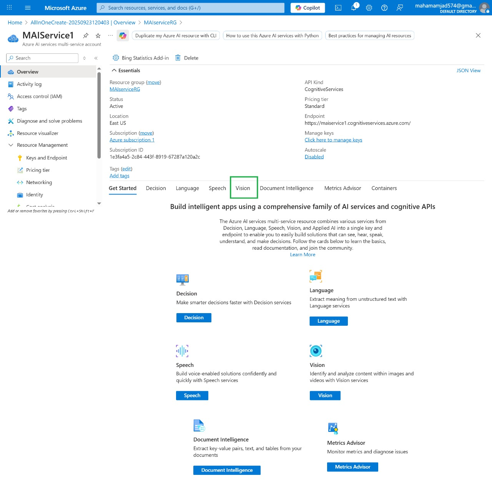
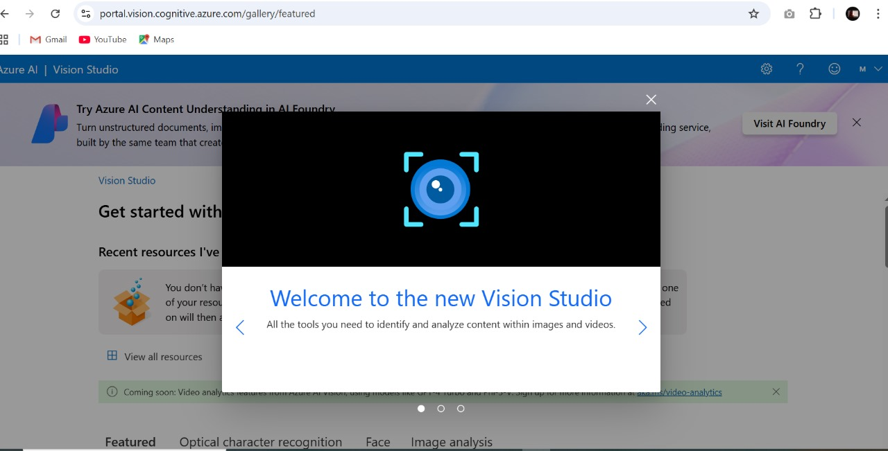
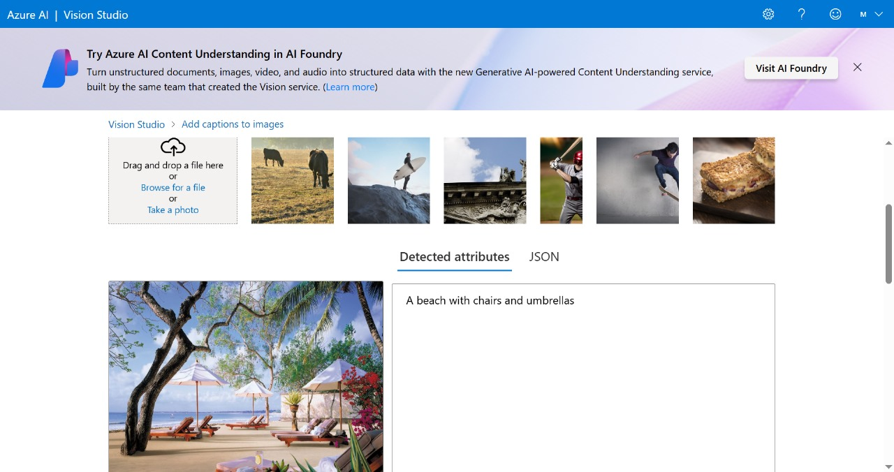
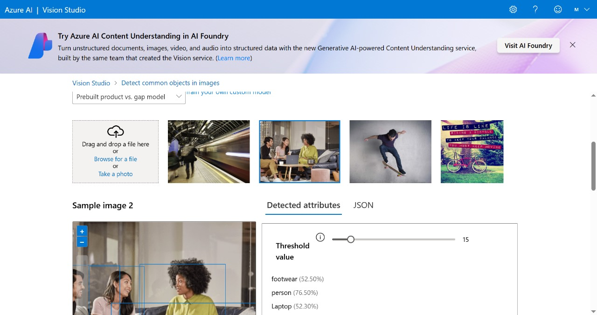
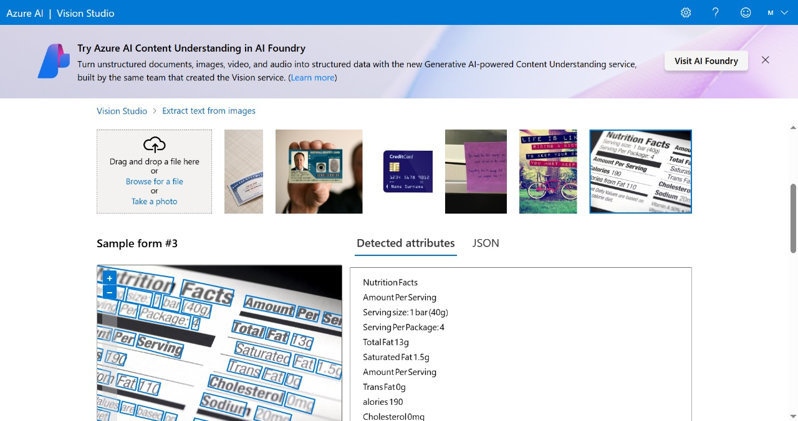

# Azure-Vision-Testing
My Azure AI Vision Services Testing.

# Azure AI Vision Services Testing Portfolio

## 📖 Project Overview
This repository documents my hands-on testing of Azure Computer Vision services. I explored various features including image analysis, object detection, and OCR capabilities.

## 🖼️ Testing Process & Results

### 1. Azure AI Service Creation
**Description:** Creating the Azure AI service resource in Azure portal

### 2. Service Successfully Created  
**Description:** Azure AI service successfully deployed and ready to use

### 3. Vision Studio Connection
**Description:** Connecting Vision Studio with my Azure account

### 4. Add Captions to Images Feature
**Description:** Testing the automatic caption generation for images

### 5. Detect Common Objects in Images
**Description:** Testing object detection capabilities

### 6. Extract Text from Images (OCR)
**Description:** Testing text extraction from images using OCR

## 🎯 Features Tested

- **Image Captioning:** AI-generated descriptions for images
- **Object Detection:** Identifying common objects in images
- **OCR (Optical Character Recognition):** Text extraction from images

## 💡 Key Learnings

- Azure Vision Services are user-friendly and require minimal setup
- Accurate results for common objects and scenes
- Fast processing time for image analysis
- Easy integration potential with applications

## 🔮 Future Exploration

- Custom vision model training
- Real-time video analysis
- Integration with web applications

---

*Documentation created based on hands-on testing of Azure AI Vision Services*
